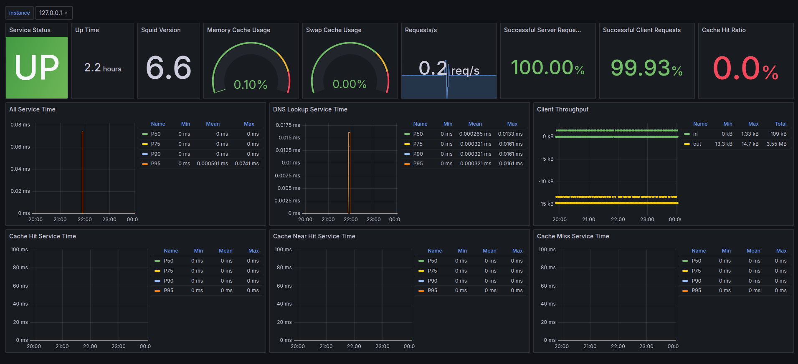

# Squid Proxy

Squid is an opensource caching proxy server that supports HTTP, HTTPS, FTP, and other protocols. It's primarily used to improve network performance by caching frequently requested content and filtering web traffic.

## Key Features

The Key Features of Squid are:

1. `Caching`: Squid caches web content so that when a user requests the same content multiple times, it serves it from the cache, reducing bandwidth usage and improving speed.

2. `Content Filtering`: It can be used for filtering based on rules such as URLs, domain names, or types of content.

3. `Proxying`: Squid acts as a middleman between clients and servers, forwarding client requests to the appropriate server and returning the server’s response.

4. `Access Control`: It can restrict access based on IP addresses, user authentication, or content types.

5. `Bandwidth Management`: Squid helps in limiting and managing bandwidth usage through rate limiting, allowing network administrators to control traffic flow.

## When to Use

Use Squid if your primary need is caching, content filtering, or bandwidth control. Squid is highly optimized for serving frequently requested content quickly and saving bandwidth by caching.

## Architecture
---


This application set up a squid proxy, with the following [configuration](./docker/squid-proxy/squid.conf)

- Just allow localhost and the IP **10.0.54.10/32** (squid proxy) to access squid proxy manager url
- Blocks access from `youtube.com`, `facebook.com` and `reddit.com`
- Requires authentication to access `google.com` and `gmail.com`
- Deny connection on ports other than 443
- Deny access on unsafety ports

## Setup
---

- [Install Docker](https://docs.docker.com/engine/install/ubuntu/)
- [Install Docker-Compose](https://docs.docker.com/compose/install/)

## Running
---

In order to run the application follow those steps:

1. Install apache2-utils to generate the user password used by squid in order to authorize access on protected endpoints
```bash
sudo apt install apache2-utils -y
```

2. Create the password file and the user
```bash
# Creates the password file
touch ./docker/squid-proxy/passwords

# Creates user and user password

# htpasswd -b <password-file> <user> <password>
htpasswd -b ./docker/squid-proxy/passwords tmissao 12345ate8

```

3. Run docker compose
```bash
docker compose up -d
```

4. Access endpoint through squid proxy using `curl`
```bash

# curl -x <proxy endpoint> -I -L <target endpoint>
# -x = use proxy
# -I = fetch headers only (to avoid verbosity)
# -L = follow any redirects until it reaches the final destination

curl -I -L http://google.com

# Request allowed (statusCode = 200)
curl -x http://localhost:3128 -I -L http://duckduckgo.com

# Request denied (statusCode = 403)
curl -x http://localhost:3128 -I -L http://facebook.com

# Request denied (statusCode = 407). authorization required
curl -x http://localhost:3128 -I -L http://google.com

# Request allowed (statusCode = 200)
curl -x http://localhost:3128 --proxy-user tmissao:12345ate8 -I -L http://gmail.com

```

## Monitoring

In order to monitor Squid Proxy the following grafana dashboard, accessing the following [link](http://localhost:3000/d/squidproxy/squid-proxy?orgId=1). To access the link make sure the entire project stack is up and running using Docker Compose.




## Results
---


## References
---

- [Squid Oficial Site](https://www.squid-cache.org/Doc/)
- [Squid Tutorial](https://adamtheautomator.com/squid-proxy/)
- [Squid Tutorial 2](https://adamtheautomator.com/squid-proxy/)
